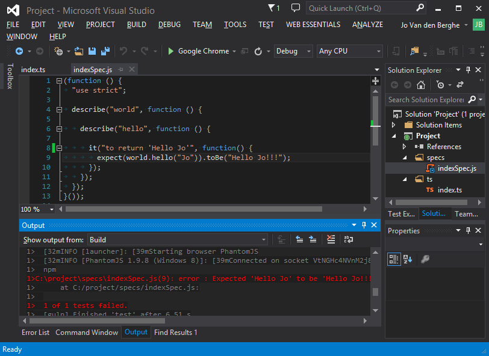
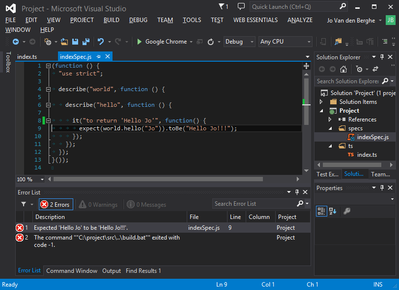

# karma-vserror-reporter

> This karma reporter plugin will log errors in visual studio style. Double click the error in the error list to go to the right file and line.

## How does it look like?
###Output:

###Error List:

## Installation
First install and configure karma, then install the karma-vserror-reporter

    $ npm install karma-vserror-reporter --save-dev

## Configuration
configure in `karma.conf.js` the new reporter:

    module.exports = function(config) {
      config.set({
        ...
        reporters: ['vserror'],
        ...
        });
      };
